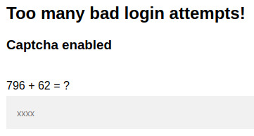

# Capture!
  
[Link](https://tryhackme.com/room/capture) for the room.

## Scanning and Enumeration
The first thing to do is usually a scan with nmap for any open ports, so I ran the following command:

    nmap -sV -sC -A -p- [machine_IP]

And I found that only port 80 appears to be open. I then tried to visit the website and found a login page. I then ran a gobuster scan to locate any interesting subdomains with the command:

    gobuster dir -k -u http://[machine_IP] -w /usr/share/dirb/wordlists/small.txt

However, I only found a page `/home` that redirects to `/login`.

## Brute Force
I started by trying to manually login with a password to write down a Hydra script. I immediately noticed that the login seems to be very verbose, particularly in that it clearly tells us if the username exists, which allows us to perform a brute force attack first on the username and later on the password.

My first try was to run hydra with

    hydra -L username.txt -p null [machine_IP] -I http-post-form "/login:username^USER^&password=^PASS^:The user"
  but after a few try a captcha appears that block my bruteforce try with hydra.

I noticed that the captcha appears as a simple operation of the type `[x] [operator] [y] = ?` directly in the HTML of the page. So, with the help of ChatGPT, I wrote a quick Python program that not only performs the brute force attack, but also solves the captcha by looking for the `?` in the HTML page and from there identifying the string concerned.
So the python script do a post with username, password and captcha and analyze the response like hydra does but other than looking for a string in the response look also for the capcha and save its content to send it on teh next POST request

[This](code/username_bruteforce.py) is the script that allowed me to find the user's username. 
After that, I made a similar script ([this](code/password_bruteforce.py)) to find the user's password.
After finding username and password of user I logged in and found the flag.
